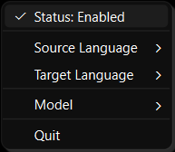
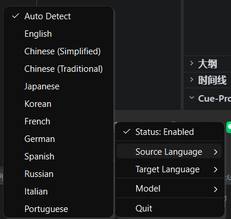
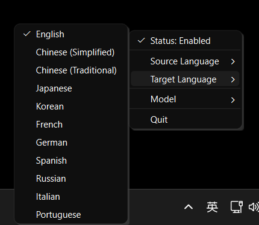
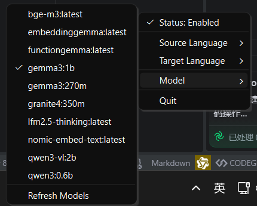

# TransPaste

TransPaste is a powerful and lightweight clipboard translation tool powered by local Large Language Models (LLMs) via Ollama. Designed to seamlessly integrate into daily workflows, TransPaste automatically detects text copied to the clipboard and replaces it with a high-quality translation in the target language.

## Project Background

In the contemporary globalized digital environment, the necessity for rapid and accurate translation is ubiquitous. Traditional translation workflows frequently involve a tedious process of copying text, navigating to a translation website or application, pasting the text, awaiting the result, copying the translation, and finally returning to the original application to paste it. This persistent context switching disrupts focus and diminishes productivity. Furthermore, numerous online translation services necessitate transmitting sensitive data to cloud servers, precipitating significant privacy concerns for professionals handling confidential documents or personal communications.

TransPaste was conceived to address these two critical issues: workflow friction and data privacy. By leveraging the capabilities of local LLMs such as `gemma3:1b` and `qwen3:0.6b` through Ollama, TransPaste ensures that data never leaves the local machine. The translation process occurs entirely on local hardware, providing assurance regarding data security. Additionally, by automating the "translate-and-replace" mechanism directly within the clipboard, TransPaste eliminates the necessity for manual context switching. Users can simply copy text in one language and immediately paste it in another, rendering cross-lingual communication as natural as native typing. This project represents a progression towards more integrated, private, and efficient AI-assisted productivity tools.

## Application Scenarios

TransPaste is versatile and applicable in numerous scenarios characterized by language barriers.

1.  **Cross-Border E-Commerce & Customer Support**: Support agents frequently need to communicate with customers in multiple languages. TransPaste facilitates the copying of a customer's query for instant comprehension, or the drafting of a response in a native language followed by the pasting of a translated version directly into the chat window, significantly accelerating response times.
2.  **Software Development**: Developers often encounter documentation, error messages, or code comments in languages not fluently spoken. With TransPaste, error logs in languages such as Japanese or Chinese can be copied and the English explanation pasted into notes or search engines, streamlining the debugging process. It also assists in variable naming by translating concepts into English identifiers.
3.  **Academic Research & Reading**: Researchers reviewing international papers can copy paragraphs of foreign text and paste the translation into summary notes. This fluid workflow encourages deeper engagement with international sources without the distraction of constant tab-switching.
4.  **Language Learning**: Language learners can utilize TransPaste to verify understanding. By copying a written sentence and pasting it back, the AI translation can be observed, or conversely, a foreign sentence can be copied to obtain an instant translation, reinforcing vocabulary and grammar knowledge in real-time.

## Compatible Hardware

Since TransPaste relies on local LLM inference provided by Ollama, hardware requirements are primarily dictated by the chosen model.

*   **Processor (CPU)**: A modern multi-core processor (Intel Core i5/i7/i9 or AMD Ryzen 5/7/9) is recommended. While Ollama can operate on CPU only, performance scales significantly with superior CPU clock speeds and core counts, particularly for quantized models.
*   **Graphics Card (GPU)**: For the optimal experience, a dedicated NVIDIA GPU with CUDA support is highly recommended. A GPU with at least 4GB of VRAM can comfortably execute smaller models like `gemma3:1b` or `qwen3:0.6b`. For larger models (7B parameter and above), 8GB to 16GB of VRAM is advisable to ensure near-instantaneous translations.
*   **Memory (RAM)**: System memory is crucial, especially if running models on the CPU or if the model size exceeds the GPU's VRAM. A minimum of 8GB RAM is required for basic operation with small models. 16GB or 32GB is recommended for smoother multitasking, ensuring that the translation process does not impede other active applications.
*   **Storage**: An SSD (Solid State Drive) is strongly recommended over an HDD. Loading models into memory necessitates rapid read speeds. Sufficient disk space is required to store the models themselves; small models may occupy 1-2GB, while larger, higher-quality models can consume 5GB to 20GB or more.

## Operating System

TransPaste is constructed using Python and the PySide6 framework (Qt for Python), rendering it inherently cross-platform.

*   **Windows**: The application is fully tested and optimized for Windows 10 and Windows 11. It integrates seamlessly with the Windows system tray and clipboard subsystem. The provided screenshots and instructions are based on the Windows environment, ensuring a native aesthetic and experience.
*   **Linux**: Linux users (specifically Ubuntu 24.04) can also operate TransPaste. The application forces the use of the XCB plugin to ensure compatibility with clipboard operations, even on Wayland-based systems (via XWayland).
    *   **Requirements**: Ensure `libxcb` and related libraries are installed. On Ubuntu:
        ```bash
        sudo apt install libxcb-cursor0 libxcb-xinerama0 libxcb-icccm4 libxcb-image0 libxcb-keysyms1 libxcb-randr0 libxcb-render-util0 libxcb-shape0 libxcb-sync1 libxcb-xfixes0 libxcb-xkb1 libxkbcommon-x11-0
        ```
    *   This ensures the PySide6 application can launch and interact with the system tray and clipboard correctly.

## Dependencies

To execute TransPaste successfully, several software components and Python libraries must be installed and configured on the system.

1.  **Python 3.10+**: The core application is written in Python. A relatively recent version of Python is required. Python 3.10 or newer is recommended to ensure compatibility with the latest type hinting features and library optimizations.
2.  **Ollama**: This serves as the backend engine powering the translations. Ollama must be downloaded and installed from [ollama.com](https://ollama.com). Ollama acts as a local server hosting the LLMs and exposing an API to which TransPaste connects. At least one model (e.g., `ollama pull gemma3:1b`) must be pulled for the application to function.
3.  **PySide6**: This library provides the graphical user interface (GUI) bindings for the Qt framework. It allows TransPaste to create the system tray icon, menus, and efficiently handle system-level clipboard events. It is a robust and mature framework for desktop application development.
4.  **Requests**: A simple yet powerful HTTP library for Python. TransPaste utilizes `requests` to communicate with the local Ollama API server, handling the transmission of prompts and the reception of generated translations.
5.  **Regex (re)**: A built-in Python module utilized for post-processing text to ensure clean output by stripping unnecessary quotes or conversational filler from the LLM's response.

## Installation Process

Follow these steps to set up TransPaste on a local machine.

1.  **Install Ollama**:
    *   Visit [ollama.com](https://ollama.com) and download the installer for the operating system.
    *   Run the installer and adhere to the on-screen instructions.
    *   Open a terminal or command prompt and execute `ollama run gemma3:1b` (or `qwen3:0.6b`) to download and verify the model is functioning. Maintain the Ollama service running in the background.

2.  **Clone the Repository**:
    *   Open a terminal.
    *   Navigate to the desired directory for the project.
    *   Execute: `git clone https://github.com/CodeOfMe/TransPaste.git`
    *   Enter the directory: `cd TransPaste`

3.  **Set Up Python Environment**:
    *   (Optional but recommended) Create a virtual environment: `python -m venv venv`
    *   Activate the virtual environment:
        *   Windows: `venv\Scripts\activate`
        *   Linux: `source venv/bin/activate`

4.  **Install Dependencies**:
    *   Since TransPaste is a Python package, installation is simple via pip:
        ```bash
        pip install .
        ```
    *   Or, if installing from PyPI (once published):
        ```bash
        pip install transpaste
        ```

5.  **Run the Application**:
    *   Execute the command: `transpaste`
    *   A clipboard icon should appear in the system tray, indicating that TransPaste is active.
    *   Command line options are also available:
        ```bash
        transpaste --model qwen3:0.6b --target French
        ```

## Running Screenshots

Below are screenshots demonstrating the usage and configuration of TransPaste.

### 1. Enable/Disable Toggle
This feature provides a quick way to pause translation without exiting the application. When disabled, the clipboard contents remain untouched, allowing for standard copy-paste operations.



### 2. Source Language Selection
Right-click the system tray icon to access the menu. Under "Source Language," the language of the text being copied can be selected. "Auto Detect" is recommended for general use, allowing the model to infer the source language automatically.



### 3. Target Language Selection
This menu permits the definition of the target language for translation. By default, it is set to English, but switching to Chinese, Japanese, French, and many others is easily accomplished depending on immediate requirements.



### 4. Model Selection
TransPaste allows the selection of the local LLM to be utilized for translation. This menu dynamically populates based on the models available in Ollama. Switching between models like `gemma3:1b` or `qwen3:0.6b` can be performed instantly.



## Authorization Agreement

TransPaste is free and open-source software licensed under the **GNU General Public License v3.0 (GPLv3)**.

This software is provided with the freedom to use, study, share, and modify. Redistribution and modification are permitted under the terms of the GPLv3, ensuring the software remains free and open for the community.
